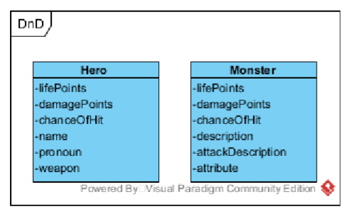

Opgaver lektion 13
Hent projektet til Lektion11 fra https://classroom.github.com/a/avtYduLo

Opgave 1
Opgavebeskrivelsen findes på slides fra denne lektion

Opgave 2
Implementer metoden printDepartures, så den udskriver en tabel over togafgange
Destination | Peron | Ankomst | Afgang
København H 1 07:57 08:04
Aalborg 2 08:03 08:10
København H 1 08:32 08:40
Skjern 2 08:46 08:52
København H 1 08:57 09:04
Aalborg 2 09:03 09:10
København H 1 09:32 09:40
Skjern 2 09:46 09:52
Du får formentlig en fejl, overvej hvorfor du får denne fejl og hvordan du kan rette den.

Opgave 3
Opret følgende to klasser i projektet opgave 3

Tilføj konstruktør til begge klasser.
2/2
Tilføj den kommenterede kode i klassen DnD.
Opret et Hero og et Monster objekt i main metoden. Kald metode fight med de to objekter.
I DnD klassen er der to statiske metoder heroAttacks og monsterAttacks, flyt disse to metoder
til henholdsvis Hero klassen og Monster klassen. Fjern static modifierer fra disse metoder og
opdater fight metoden i DnD klassen, så den kalder disse metoder.

Opgave 4
Opgave 9.1 fra bogen
Opgave 5
Opgave 9.2 fra bogen